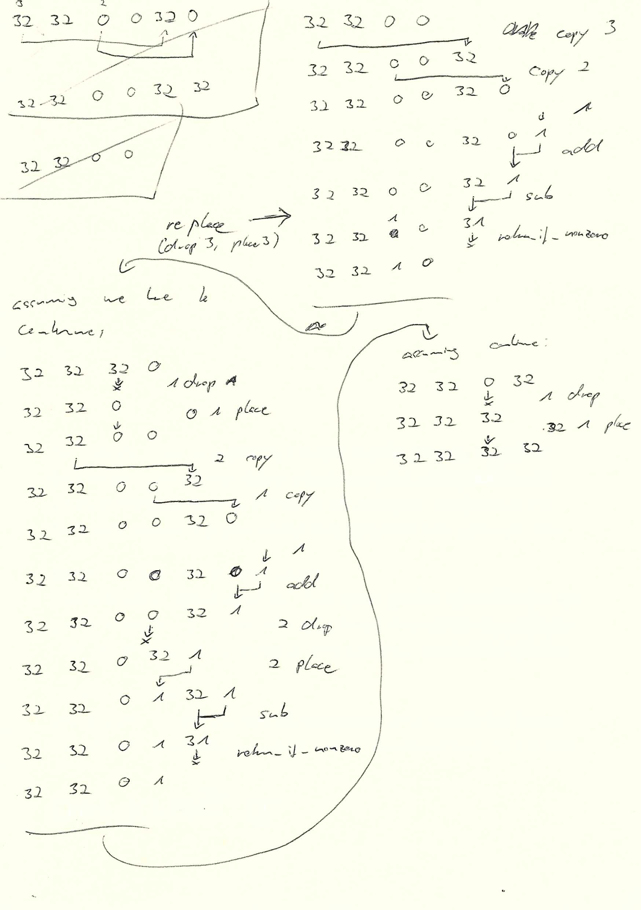

These are some notes I made while developing a program written with the current
prototype version of Caterpillar:

This was very tedious, but weirdly fun. It also contains mistakes, and even
though I found some of those while transcribing it to digital code, it didn't
end up working. (Not surprising!)

All that is to say that the language, in its current basic form, is confusing as
hell and borderline impossible to use. But I'm not fixing that. Not now. I'd
like to know what happens, if I combine this confusing language with good
tooling for understanding it.
