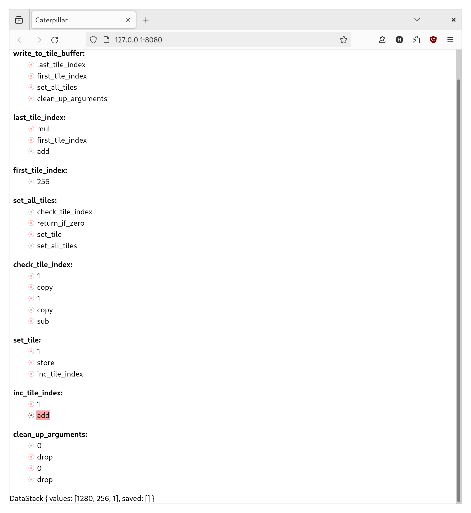

The core questions I want to answer with the current prototype are a) whether
building a debugger is feasible, and b) whether having one will help make an
otherwise confusing language practical to use. I have some news on that first
question!

This doesn't have any of the buttons you'd expect from a debugger, but you can
set and remove breakpoints. And that enables you to step over, step into, or
continue to wherever you want; just in the most inconvenient way possible. And
you have to scroll all the time to see the information you need. But hey, it
works!

It would sure be great for someone with an eye for design and a preference for
frontend work to show up and save me right about now, but I guess I'm on my own
for the time being. Oh well. Time to figure out if I can use this thing to make
sense of that broken code I have sitting in a local branch.
